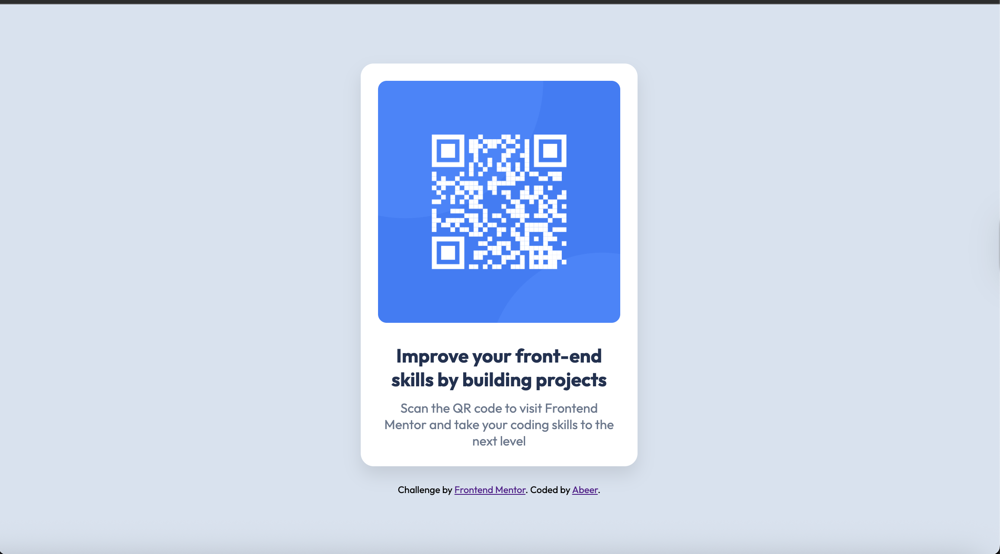
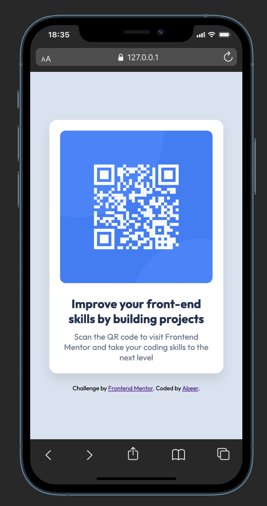

# Frontend Mentor - QR code component solution

This is a solution to the [QR code component challenge on Frontend Mentor](https://www.frontendmentor.io/challenges/qr-code-component-iux_sIO_H). Frontend Mentor challenges help you improve your coding skills by building realistic projects. 

## Table of contents

- [Overview](#overview)
  - [Screenshot](#screenshot)
  - [Links](#links)
- [My process](#my-process)
  - [Built with](#built-with)
  - [Useful resources](#useful-resources)
- [Author](#author)
- [Acknowledgments](#acknowledgments)

## Overview

### Screenshot

### Links

- Live Site URL: [QR code](https://abeeralamri.github.io/QR-code/)

## My process

### Built with

- HTML
- CSS custom properties

### What I learned

- Box model → worked with padding, margin, border-radius, and box-shadow.
- box-sizing: border-box; → understanding how element sizing works.
- font-weight → using 400 vs 700 to match Figma design.
- Typography → setting font-family, font-size, and aligning with design specs.

### Useful resources

- [MDN](https://developer.mozilla.org/en-US/docs/Learn_web_development/Core/Styling_basics) 

## Author

- Frontend Mentor - [@abeeralamri](https://www.frontendmentor.io/profile/abeeralamri)
